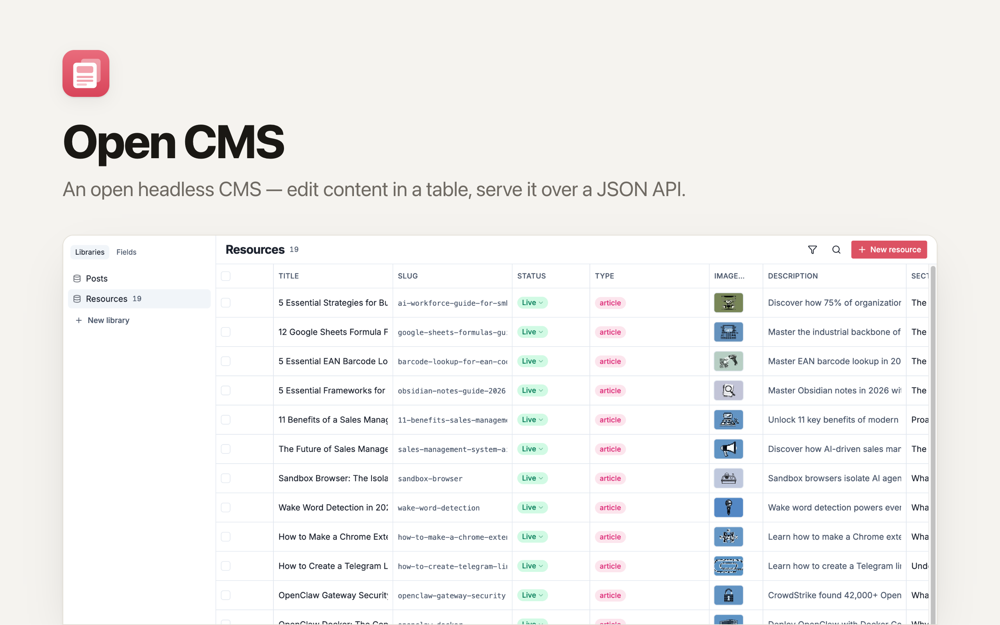

# Open CMS

A headless content-management studio built for **Clawnify**. **React + Tailwind CSS + Hono + D1 + R2**, deployed to Cloudflare Workers via [Clawnify](https://clawnify.com).

Auth, plugins, and integrations are handled by Clawnify — this template focuses on a clean editing UI and a typed REST API that Clawnify agents can consume from day one.


## Features

- **Spreadsheet-style table** — every field is a column; cells are inline-editable (text, image, status, featured)
- **Slide-in editor sheet** — opens as an overlay (table stays visible underneath) for rich-text editing
- **Rich-text content** — Tiptap editor with image upload, links, lists, blockquote, code blocks, and headings
- **Live status pill** — green / gray pill with embedded chevron, change inline or from the editor
- **Custom field types** — pick Score (colored gauge), Badge (enum as colored pills), URL, Email, Phone, or Tags when adding a field; each renders a purpose-built widget over a plain base-type column
- **Auto-save with debounce** — 350ms debounce, Saving / Saved / Error indicator
- **Slug auto-generation** — slugified from title, kept unique server-side, with live URL preview
- **Image library on R2** — upload from cell or rich-text editor, served from `/api/uploads/:filename`
- **OpenAPI spec at `/api/openapi.json`** — Clawnify agents introspect the schema and call endpoints directly
- **URL routing** — `pushState`-based, bookmarkable post URLs (`/posts/:id`)

## Quickstart

```bash
git clone https://github.com/clawnify/open-cms.git
cd open-cms
pnpm install
```

Start the dev server:

```bash
pnpm dev
```

Open `http://localhost:5173`. The D1 schema is applied automatically on the first request.

No environment variables required — Clawnify provides auth and any third-party credentials at deploy time.

## Tech Stack

| Layer | Technology |
|-------|-----------|
| **Frontend** | React 19, TypeScript, Tailwind CSS v4, Vite |
| **UI** | shadcn/ui (radix-nova preset), lucide-react |
| **Table** | TanStack Table v8 |
| **Editor** | Tiptap v3 (StarterKit + Image + Link + Placeholder) |
| **Backend** | Hono on Cloudflare Workers, `@hono/zod-openapi` |
| **Database** | D1 (SQLite at the edge) |
| **Storage** | R2 (file uploads) |

### Prerequisites

- Node.js 22+
- pnpm

## Architecture

```
src/
  server/
    index.ts              — Worker entry, Hono app + D1/R2 middleware + auto-schema
    routes-posts.ts       — REST endpoints for posts (OpenAPI-documented)
    routes-uploads.ts     — Multipart upload + serving from R2
    db.ts                 — D1 query/get/run helpers
    uploads.ts            — R2 put/get adapter
    schema.sql            — Posts table, indexes, status check
  client/
    main.tsx              — React mount point
    app.tsx               — Root: sidebar + table + sheet overlay editor
    hooks/
      use-router.ts       — pushState routing for /posts/:id
    lib/
      api.ts              — Typed fetch client
      types.ts            — Post, PostStatus, PostPatch
      utils.ts            — cn() shadcn helper
    components/
      sidebar.tsx         — Collections / Fields tabs (Plugins owned by Clawnify)
      posts-table.tsx     — TanStack Table with inline cell editors
      post-editor.tsx     — Sheet content: all fields + rich-text editor
      rich-editor.tsx     — Tiptap toolbar + EditorContent + image upload
      status-pill.tsx     — Green / gray pill, optional chevron
      ui/                 — shadcn primitives (table, button, sheet, select, …)
```

### API Endpoints

| Method | Endpoint | Description |
|--------|----------|-------------|
| GET    | `/api/posts`              | List all posts (newest first) |
| POST   | `/api/posts`              | Create a post (optional title) |
| GET    | `/api/posts/:id`          | Get a single post |
| PATCH  | `/api/posts/:id`          | Update any subset of fields |
| DELETE | `/api/posts/:id`          | Delete a post |
| POST   | `/api/uploads`            | Multipart image upload, returns `{ url, filename }` |
| GET    | `/api/uploads/:filename`  | Serve an uploaded file from R2 |
| GET    | `/api/openapi.json`       | OpenAPI 3.0 spec for the whole API |

## Deploy

```bash
npx clawnify deploy
```

## License

MIT
